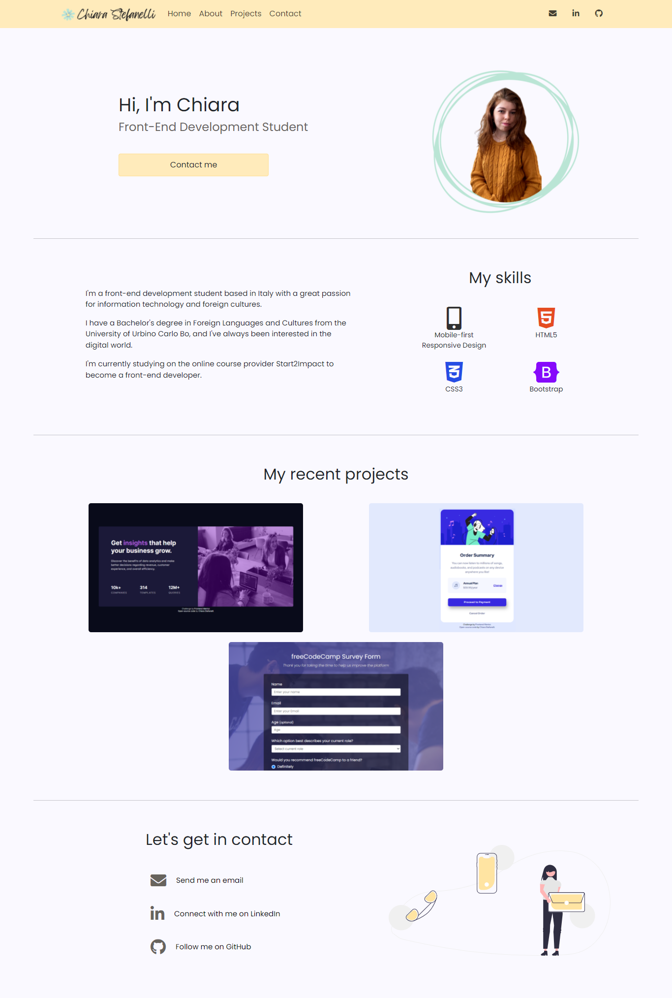
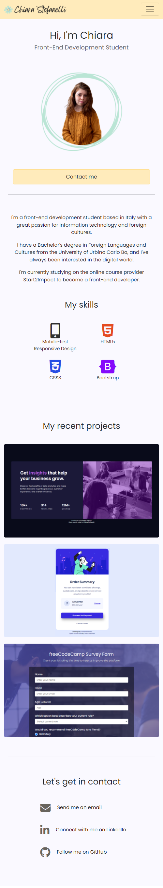

# Personal Portfolio Website - Chiara Stefanelli

This is my personal portfolio website. It's the first project from the online front-end development course on [Start2Impact](https://www.start2impact.it/).

## Link

- [Website url](https://chiarastef.github.io/personal-portfolio/)

## Built with

- Semantic HTML5 markup
- CSS custom properties
- JavaScript
- Sass
- Bootstrap

## Screenshots

 

## Author

Chiara Stefanelli - Front-End Development Student based in Italy
- Website - [Chiara Stefanelli](https://chiarastef.github.io/personal-portfolio/)
- LinkedIn - [Chiara Stefanelli](https://www.linkedin.com/in/chiarastefanelli/?locale=en_US)
