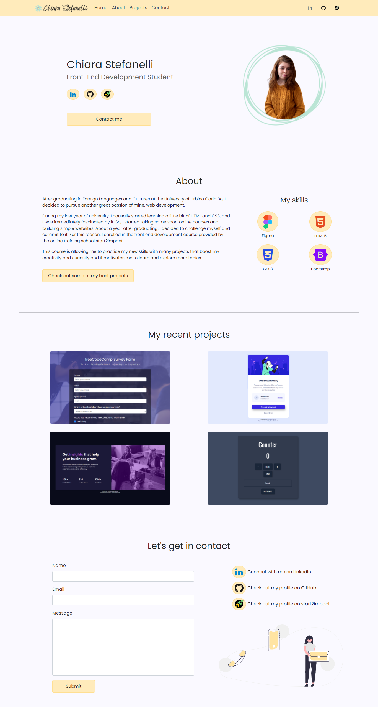
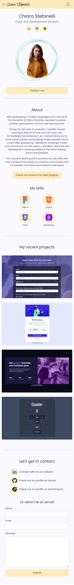

# Personal Portfolio Website - Chiara Stefanelli

This is my personal portfolio website. It's the first project from the online front-end development course on [Start2Impact](https://www.start2impact.it/).

## Link

- [Website url](https://chiarastefanelli.netlify.app/) (hosted on Netlify).

## Screenshots

 

## Built with

- Semantic HTML5 markup
- CSS custom properties
- JavaScript
- Sass
- Bootstrap
- EmailJS

## Author

Chiara Stefanelli - Front-End Development Student based in Italy
- Website - [Chiara Stefanelli](https://chiarastefanelli.netlify.app/)
- LinkedIn - [Chiara Stefanelli](https://www.linkedin.com/in/chiarastefanelli/?locale=en_US)
- start2impact profile - [Chiara Stefanelli](https://talent.start2impact.it/profile/chiara-stefanelli-13)

